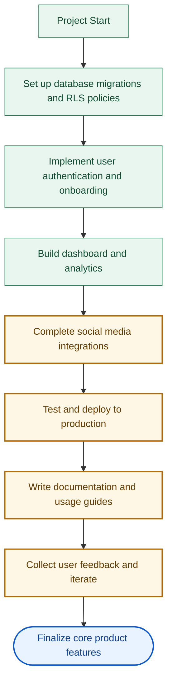

# Project TODOs

## Status Flow

## Completion Checklist

- [x] Set up database migrations and RLS policies
- [x] Implement user authentication and onboarding
- [x] Build dashboard and analytics
- [ ] Complete social media integrations (Twitter, Instagram, Telegram, YouTube, TikTok)
- [ ] Test and deploy to production
- [x] Write documentation and usage guides
- [ ] Collect user feedback and iterate
- [ ] Finalize core product features

## Finish The Rest (Execution Order)

1. Complete social integrations
	- confirm each OAuth callback works in local and production
	- verify account link persistence in dashboard
2. Test and deploy to production
	- run lint/type checks and key API route smoke tests
	- complete production deploy checklist
3. Write documentation and usage guides
	- quick-start for creators
	- operator runbook for debug/admin pages
4. Collect user feedback and iterate
	- onboard first beta creators
	- track top 5 pain points and apply fixes
5. Finalize core product features
	- lock MVP scope
	- move non-MVP items into post-launch roadmap

## Release Readiness Snapshot (2026-04-03)

- Build: pass (`npm run build`)
- Type check: pass (via Next.js build pipeline)
- Lint: pass (`npm run lint -- --quiet`)
- Deployment: not executed yet (manual step remaining)

## Final Deployment Gates

- [x] Gate 1: Quality checks pass (`npm run lint -- --quiet`, `npm run build`)
- [x] Gate 2: API routes compile in production build
- [ ] Gate 3: Production secrets configured in Vercel
- [ ] Gate 4: OAuth callbacks verified on production domain
- [ ] Gate 5: Production deployment executed (`vercel --prod` or push to main)
- [ ] Gate 6: Post-deploy smoke test run on live URL

## Required Production Env Matrix

Core:
- [ ] `NEXT_PUBLIC_SUPABASE_URL`
- [ ] `NEXT_PUBLIC_SUPABASE_ANON_KEY`
- [ ] `SUPABASE_SERVICE_ROLE_KEY`
- [ ] `NEXT_PUBLIC_SITE_URL`
- [ ] `TOKEN_ENCRYPTION_KEY`

AI:
- [ ] `OPENROUTER_API_KEY`
- [ ] `OPENAI_API_KEY` (required for marketing agent route)

Email + Analytics:
- [ ] `RESEND_API_KEY`
- [ ] `NEXT_PUBLIC_POSTHOG_KEY` (optional but recommended)
- [ ] `NEXT_PUBLIC_POSTHOG_HOST` (optional)

Payments:
- [ ] `WHOP_API_KEY` or creator-managed Whop checkout links confirmed
- [ ] `WHOP_WEBHOOK_SECRET` (when webhook route is implemented)

Social OAuth:
- [ ] `TWITTER_CLIENT_ID`
- [ ] `TWITTER_CLIENT_SECRET`
- [ ] `TWITTER_CALLBACK_URL`
- [ ] `INSTAGRAM_CLIENT_ID`
- [ ] `INSTAGRAM_CLIENT_SECRET`
- [ ] `INSTAGRAM_CALLBACK_URL`
- [ ] `YOUTUBE_CLIENT_ID`
- [ ] `YOUTUBE_CLIENT_SECRET`
- [ ] `TIKTOK_CLIENT_KEY`
- [ ] `TIKTOK_CLIENT_SECRET`
- [ ] `TELEGRAM_BOT_TOKEN`

## Immediate Closeout Sequence

1. Populate missing env vars in Vercel project settings.
2. Run production deploy.
3. Execute smoke tests: `/`, `/login`, `/dashboard`, core API routes, and each enabled OAuth callback.
4. Mark `Test and deploy to production` complete.
5. Mark `Write documentation and usage guides` complete after adding quick-start + operator notes.
6. Run first beta cohort and mark `Collect user feedback and iterate` complete.
7. Mark `Finalize core product features` complete and move non-MVP work to post-launch roadmap.

## Execution Board (Done/Blocked)

| Workstream | Status | Owner | ETA | Blocker | Exit Criteria |
|---|---|---|---|---|---|
| Quality gates (lint/build/typecheck) | DONE | Mehdi + Copilot | 2026-04-03 | None | `npm run lint -- --quiet` and `npm run build` both pass |
| Docs and runbooks | DONE | Mehdi + Copilot | 2026-04-03 | None | Quick start + operator runbook committed |
| Social integrations end-to-end | BLOCKED | Mehdi | 2026-04-04 | Requires live provider credentials and callback validation | All enabled providers connect and callback successfully on production domain |
| Production secrets setup | BLOCKED | Mehdi | 2026-04-03 | Manual Vercel config pending | Required keys present in Vercel project settings |
| Production deploy | BLOCKED | Mehdi | 2026-04-03 | Secrets + OAuth readiness not fully confirmed | Successful `vercel --prod` (or main deploy) and healthy build |
| Post-deploy smoke test | BLOCKED | Mehdi | 2026-04-03 | Deploy not yet completed | Core routes and API smoke tests pass on live URL |
| Beta feedback loop | BLOCKED | Mehdi + first creators | 2026-04-07 | Needs deployed build + initial users | Top 5 issues captured and first fixes applied |
| Finalize core product features | BLOCKED | Mehdi | 2026-04-08 | Depends on beta feedback and scope lock | MVP scope frozen and non-MVP moved to post-launch roadmap |

## Local Env Gap Check (2026-04-03)

Checked from `.env.local` key presence (values not exposed):

- Missing: `SUPABASE_SERVICE_ROLE_KEY`
- Missing: `WHOP_API_KEY` or creator-managed Whop link configuration

Note: This reflects local file status only. Vercel project settings may differ and should be verified directly.
